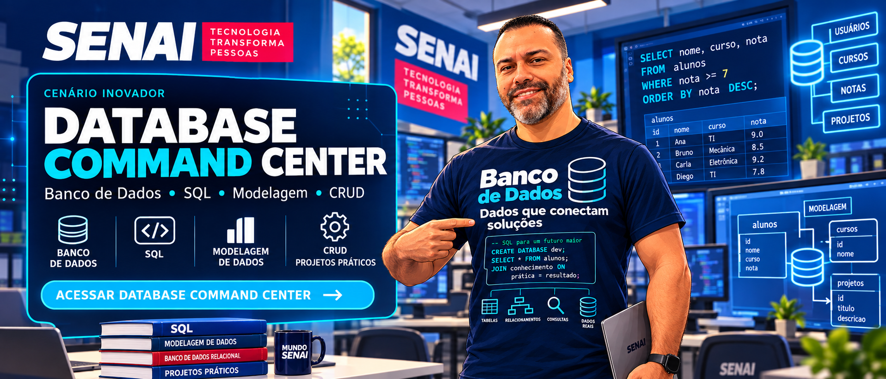

<div align="center">

# PORTAL 

### Ambiente Interativo de Aprendizagem — Desenvolvimento de Sistemas

**Escola SENAI Luiz Varga — Limeira/SP — CFP 505**

> **Aprenda. Experimente. Desenvolva.**

<br> -->

[](https://brunoamoraes.github.io/PORTAL-BASE/index.html)

<!-- </div> -->

---

## 🎮 Escolha seu universo

O **Portal** reúne dois ambientes de aprendizagem dentro do mesmo portal. Cada trilha possui conteúdos, missões, laboratórios, desafios, checkpoints e projetos práticos.

### 🪐 Database Command Center

<a href="https://brunoamoraes.github.io/PORTAL-BASE/index.html">
  
</a>

<!-- **Banco de Dados • SQL • Modelagem • DQL • DML • CRUD • SmartCoffee** -->

> Clique no banner para acessar o **Database Command Center**.

---

### 🔴 Hawkins Web Lab

<a href="https://brunoamoraes.github.io/PORTAL-BASE/index.html">
  
</a>

<!-- **HTML • CSS • JavaScript • DOM • Wireframe • Figma • Desenvolvimento Web** -->

> Clique no banner para acessar o **Hawkins Web Lab**.

---

<!-- ## 🧭 Como funciona a jornada

```text
Página Inicial
      ↓
Portal de Login
      ↓
Autenticação Supabase
      ↓
Perfil autorizado
      ↓
┌──────────────────────┬──────────────────────┐
│ Database Command     │ Hawkins Web Lab      │
│ Center               │                      │
└──────────────────────┴──────────────────────┘
      ↓
Missões • Aulas • Laboratórios • Checkpoints
      ↓
Minha Jornada
```

---

## 🪐 Database Command Center

A trilha de Banco de Dados transforma os conteúdos em uma sequência de **missões**.

| Missão | Conteúdo |
|---|---|
| 01 | Universo dos Dados |
| 02 | Entidades, atributos e MER |
| 03 | Relacionamentos e cardinalidades |
| 04 | Chaves primárias e estrangeiras |
| 05 | Modelo lógico e dicionário de dados |
| 06 | DDL — implantação da base |
| 07 | Constraints e integridade |
| 08 | DQL — inteligência de dados |
| 09 | DML — manipulação de dados |
| 10 | Operação SmartCoffee — CRUD |

### ☕ Projeto SmartCoffee

O **SmartCoffee** funciona como projeto integrador da trilha, permitindo ao aluno aplicar progressivamente:

```text
Modelagem
   ↓
Banco de Dados
   ↓
SQL
   ↓
HTML / CSS / JavaScript
   ↓
CRUD
   ↓
Aplicação Web
```

---

## 🔴 Hawkins Web Lab

No Hawkins Web Lab, o aluno percorre uma trilha de desenvolvimento Web inspirada em um ambiente de ficção científica e suspense.

| Aula | Conteúdo |
|---|---|
| 01 | Fundamentos da Web |
| 02 | Estrutura HTML |
| 03 | HTML Semântico |
| 04 | Cores na Web |
| 05 | Imagens |
| 06 | CSS |
| 07 | Layouts |
| 08 | Wireframe |
| 09 | Figma e Alta Fidelidade |
| 10 | Wireframe → HTML |
| 11 | Flexbox |
| 12 | CSS Avançado |
| 13 | JavaScript e DOM |
| 14 | JavaScript Aplicado |
| 15 | Projeto Integrado |
| 16 | Formulário + Banco de Dados |

---

## 🧪 Aprender fazendo

Cada aula ou missão segue uma estrutura didática comum:

**📡 Briefing → 📚 Conteúdo → 🧪 Laboratório → 🎯 Sua Missão → 👾 Boss Challenge → ✅ Checkpoint**

O objetivo é fazer com que o aluno não apenas leia o conteúdo, mas **experimente, teste, erre, corrija e construa soluções**.

---

## 💻 Laboratórios interativos

O portal possui ambientes práticos diretamente no navegador.

### SQL Lab

```sql
SELECT nome, preco
FROM produto
WHERE preco > 10
ORDER BY preco DESC;
```

### HTML Lab

```html
<main>
    <section>
        <article>
            <h2>Hawkins Web Lab</h2>
            <p>Experimento iniciado.</p>
        </article>
    </section>
</main>
```

### Flexbox Control Room

```css
display: flex;
justify-content: center;
align-items: center;
gap: 1rem;
```

## Minha Jornada

Cada aluno possui uma área de acompanhamento onde pode visualizar:

- aulas e missões concluídas;
- progresso em Banco de Dados;
- progresso no Hawkins Web Lab;
- checkpoints realizados;
- continuidade da trilha.

--- -->

## Tecnologias

<div align="center">


<!--  -->


</div>


<!-- ## 🌐 Acesso

<div align="center">

### [🚀 ACESSAR PORTAL](https://brunoamoraes.github.io/PORTAL-BASE/index.html)

**Aprenda. Experimente. Desenvolva.**

</div>

--- -->

## Projeto Educacional

**Escola SENAI Luiz Varga — Limeira/SP — CFP 505**  
Curso Técnico em Desenvolvimento de Sistemas

Desenvolvido por Bruno Moraes
