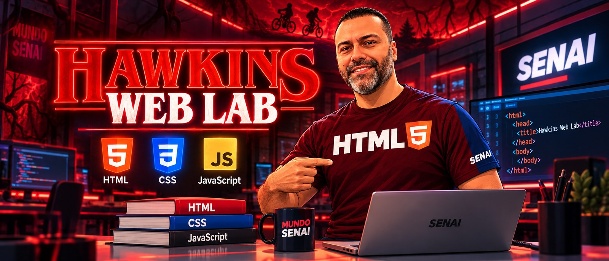

<div align="center">

<!-- # 🚀 Portal

### Ambiente Interativo de Aprendizagem · Desenvolvimento de Sistemas

**Escola SENAI Luiz Varga — Limeira/SP — CFP 505**

> **Aprenda. Experimente. Desenvolva.**

[🌐 ACESSAR O PORTAL](https://brunoamoraes.github.io/cenario-inovador/)

</div>

---

## 🧭 Escolha seu universo -->

### 🪐 Database Command Center

[](https://brunoamoraes.github.io/cenario-inovador/database/index.html)

<!-- **Banco de Dados · SQL · Modelagem · DDL · DQL · DML · Constraints · CRUD · SmartCoffee** -->

> Clique no banner para entrar diretamente no **Database Command Center**.

---

### 🔴 Hawkins Web Lab

[](https://brunoamoraes.github.io/cenario-inovador/web/index.html)

**HTML · CSS · JavaScript**

> Clique no banner para entrar diretamente no **Hawkins Web Lab**.

---

## Como funciona

O **Portal** transforma o conteúdo das aulas em uma experiência prática. Cada trilha combina explicação, experimentação e desafios no próprio navegador.

**Briefing → Conteúdo → Laboratório → Sua Missão → Boss Challenge → Checkpoint**

O progresso dos checkpoints é armazenado localmente no navegador do dispositivo, sem necessidade de login.

<!-- ## 🪐 Trilha Database Command Center

| Missão | Conteúdo |
|---|---|
| 01 | Universo dos Dados |
| 02 | Mapeando a Galáxia |
| 03 | Relacionamentos e Cardinalidades |
| 04 | Chaves Primárias e Estrangeiras |
| 05 | Modelo Lógico e Dicionário de Dados |
| 06 | DDL e Implantação |
| 07 | Constraints e Integridade |
| 08 | DQL e SQL Challenge Center |
| 09 | DML — INSERT, UPDATE e DELETE |
| 10 | Operação SmartCoffee — CRUD |

## 🔴 Trilha Hawkins Web Lab

| Aula | Conteúdo |
|---|---|
| 01 | Fundamentos da Web |
| 02 | Estrutura HTML |
| 03 | HTML Semântico |
| 04 | Cores na Web |
| 05 | Imagens |
| 06 | CSS |
| 07 | Layouts |
| 08 | Wireframe |
| 09 | Figma e Alta Fidelidade |
| 10 | Wireframe → HTML Semântico |
| 11 | Flexbox |
| 12 | CSS Avançado |
| 13 | JavaScript + DOM |

## 🧪 Laboratórios interativos

O portal contém experiências como **SQL Lab**, **DDL Lab**, **SQL Challenge Center**, **CSS Lab**, **Wireframe Builder**, **Prototype Lab**, **HTML Translator**, **Flexbox Control Room** e **DOM Signal Lab**. -->

## ☕ Projeto SmartCoffee

O SmartCoffee conecta o aprendizado de Banco de Dados à construção de um sistema real, passando por modelagem, SQL, regras de negócio e CRUD.

## 🛠️ Tecnologias


<!-- ## 📁 Estrutura

```text
cenario-inovador/
├── index.html
├── README.md
├── assets/
│   ├── css/
│   ├── js/
│   └── readme/
├── database/
│   ├── index.html
│   └── missoes/
└── web/
    ├── index.html
    └── aulas/
``` -->

<!-- ## 🌐 Publicação

O projeto foi preparado para **GitHub Pages**. Mantenha `index.html` na raiz do repositório e configure **Settings → Pages → Deploy from a branch → main → /(root)**.

> Caso o nome do repositório ou usuário do GitHub seja diferente, atualize os links absolutos dos banners neste README. -->

---

<div align="center">

### SENAI · Desenvolvimento de Sistemas
**Escola SENAI Luiz Varga — Limeira/SP — CFP 505**

**Portal — Aprenda. Experimente. Desenvolva.**

**Desenvolvido por Bruno Moraes**

</div>
